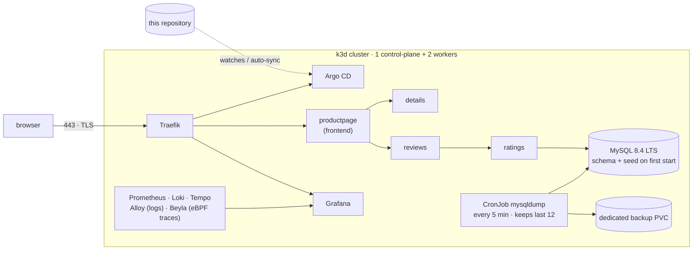

# DevOps Practical Task - Kubernetes + GitOps + Helm + Observability

A complete GitOps stand on a local Kubernetes cluster. One command deploys everything from scratch: the cluster, Argo CD, MySQL with automated backups, a microservice application, full observability (metrics + logs + eBPF traces) and trusted HTTPS - on macOS, Linux or Windows (WSL2).

```sh
git clone https://github.com/arevozyan-vention/test-repo.git && cd test-repo
./scripts/bootstrap-macos.sh        # macOS   |   Windows/WSL: ./scripts/bootstrap-wsl.sh
```

In ~25 minutes the script opens three browser tabs with green locks and prints the credentials:

| | URL | Login |
|---|---|---|
| **Bookinfo** - the application | https://bookinfo.localhost/productpage | - |
| **Grafana** - monitoring | https://grafana.localhost | `admin` / printed by the script |
| **Argo CD** - GitOps | https://argocd.localhost | `admin` / printed by the script |

Credentials are unique per installation - **not a single secret is stored in git**.

Verified end to end with from-scratch runs on **macOS (Apple Silicon)** and **Windows 11 + WSL2 (Ubuntu)**.



---

## Bootstrap scripts: what exactly happens

The scripts are designed for a **completely bare machine** and do nothing silently:

1. **Environment check** - a table for every tool: `ok` (installed - will be skipped) or `NOT found`
2. **Install plan** - what gets installed and from where, with a reason for every item
3. **A single confirmation** - `Proceed? [y/N]`. The `--yes` flag skips the question
4. **Installing what is missing**
   - macOS: via Homebrew (Homebrew itself - if absent); the docker runtime is **Colima** (a lightweight VM: 4 CPU / 12 GB / 40 GB), no Docker Desktop required
   - WSL: **Docker Engine from the official Docker apt repository** + k3d, kubectl, terraform (hashicorp apt), task, mkcert. After joining the docker group the script continues under it without relogin (sg); if the system does not allow that, it asks for `wsl --shutdown` and a re-run, then continues where it left off
5. **`task up`** - cluster → certificates → secrets → Terraform (Argo CD) → GitOps deploys everything else
6. **Waiting for readiness** - until all 5 Argo applications become Healthy (the first run pulls ~10 GB of images, 15-30 min)
7. **Finale** - credentials in the terminal, a strict TLS probe of every URL (curl **without** `-k`: the certificate is real and the CA is trusted), then browser tabs open in the default browser (on WSL - in the Windows browser)

### When and why the script asks for a password

Every prompt is a standard OS security mechanism, none of them belong to the script itself:

| Moment | What is asked | Why |
|---|---|---|
| macOS: Homebrew install (only if missing) | macOS password | the Homebrew installer needs sudo to create `/opt/homebrew` |
| macOS: trusting the CA (`mkcert -install` inside `task up`) | macOS password | writing a root certificate into the system keychain is a protected operation |
| WSL: package installation | sudo password | system packages are installed via apt |
| WSL: trusting the CA on Windows (certutil, end of install) | Windows dialog "Install this certificate?" → **Yes** | adds the root CA to the Windows cert store so the browser trusts `https://*.localhost` |

The CA is local, generated by mkcert for this machine only; the private key never leaves it.

The scripts are **idempotent**: a re-run skips what is done and continues from where it stopped.

### Manual path (no bootstrap script)

Everything the scripts do can be done by hand: install a docker runtime plus `k3d`, `kubectl`, `terraform` >= 1.9, `task`, `mkcert`, then run `task up`.

<details>
<summary>macOS</summary>

```sh
# Homebrew, if missing
/bin/bash -c "$(curl -fsSL https://raw.githubusercontent.com/Homebrew/install/HEAD/install.sh)"

brew install colima docker k3d kubectl go-task mkcert
brew install hashicorp/tap/terraform        # terraform left homebrew-core

colima start --cpu 4 --memory 12 --disk 40
task up
```
</details>

<details>
<summary>Windows / WSL2 (Ubuntu)</summary>

```sh
# docker engine from the official apt repo
sudo install -m 0755 -d /etc/apt/keyrings
curl -fsSL https://download.docker.com/linux/ubuntu/gpg | sudo tee /etc/apt/keyrings/docker.asc >/dev/null
echo "deb [arch=$(dpkg --print-architecture) signed-by=/etc/apt/keyrings/docker.asc] https://download.docker.com/linux/ubuntu $(lsb_release -cs) stable" | sudo tee /etc/apt/sources.list.d/docker.list >/dev/null
sudo apt-get update && sudo apt-get install -y docker-ce docker-ce-cli containerd.io
sudo usermod -aG docker $USER               # then 'wsl --shutdown' and reopen Ubuntu

# tools
curl -s https://raw.githubusercontent.com/k3d-io/k3d/main/install.sh | sudo bash
curl -fsSLo /tmp/kubectl "https://dl.k8s.io/release/$(curl -Ls https://dl.k8s.io/release/stable.txt)/bin/linux/amd64/kubectl" && sudo install /tmp/kubectl /usr/local/bin/kubectl
curl -fsSL https://apt.releases.hashicorp.com/gpg | sudo gpg --dearmor -o /usr/share/keyrings/hashicorp.gpg
echo "deb [signed-by=/usr/share/keyrings/hashicorp.gpg] https://apt.releases.hashicorp.com $(lsb_release -cs) main" | sudo tee /etc/apt/sources.list.d/hashicorp.list >/dev/null
sudo apt-get update && sudo apt-get install -y terraform mkcert libnss3-tools
curl -fsSL https://taskfile.dev/install.sh | sudo sh -s -- -d -b /usr/local/bin

task up

# trust the CA in the Windows cert store (the bootstrap script does this automatically)
certutil.exe -user -addstore Root "$(wslpath -w "$(mkcert -CAROOT)/rootCA.pem")"
```
</details>

Not needed: `helm` (Terraform and Argo CD render charts themselves), `argocd` CLI, a mysql client.

**Resources**: give the docker runtime 12 GB RAM / 4+ CPU / 40 GB disk. WSL: set it in `C:\Users\<you>\.wslconfig` (`[wsl2]` → `memory=12GB`), then `wsl --shutdown`.

---

## GitOps architecture

Terraform (Helm Provider) installs **Argo CD** and creates the **root Application** - the entry point of the **App of Apps** pattern. From there GitOps drives the lifecycle: the root watches `argocd/apps/`, which holds four child Applications:

| Application | Path | Deploys | Namespace |
|---|---|---|---|
| `infrastructure` | `infrastructure/` | MySQL (Bitnami) + backup CronJob + PVC | `database` |
| `applications` | `applications/bookinfo` | the custom Bookinfo chart (4 services) | `bookinfo` |
| `monitoring` | `monitoring/` | Prometheus, Grafana, Loki, Tempo, Alloy, Beyla | `monitoring` |
| `cert-manager` | `cert-manager/` | cert-manager + the local CA ClusterIssuer | `cert-manager` |

All of them run `automated sync + prune + selfHeal + retry`. **`git push` to the branch = deployment**; manual drift in the cluster is automatically reverted back to git. A new component = one YAML in `argocd/apps/` - monitoring and cert-manager were added exactly that way, with zero Terraform changes.

<details>
<summary>Why the Applications are not created via kubernetes_manifest</summary>

`kubernetes_manifest` requires the Argo CD CRDs to exist at `terraform plan` time - the first `apply` on a fresh cluster fails. Instead there is a second `helm_release` with the official `argocd-apps` chart: a single `terraform apply` works from scratch and yields a true App of Apps.
</details>

```
├── Taskfile.yml            # up / down / cluster / certs / secrets / deploy
├── k3d/cluster.yaml        # declarative cluster config, k3s image pinned
├── scripts/                # bootstrap-macos.sh, bootstrap-wsl.sh
├── terraform/              # Argo CD + root app; lock file for 5 platforms
├── argocd/apps/            # 4 child Applications (App of Apps)
├── applications/bookinfo/  # one chart: frontend + backend
├── infrastructure/         # MySQL + backups + schema init
├── monitoring/             # observability stack + dashboards as code
└── cert-manager/           # cert-manager + ClusterIssuer
```

---

## Component highlights

**Bookinfo** (the Istio demo, running without Istio) - the only public application with prebuilt official images, an honest frontend/backend split and real MySQL usage: `productpage` (frontend) → `details`, `reviews`, `ratings` (backend), where `ratings` reads from the database - **the stars on the page are rows of the `test.ratings` table**. A single Helm chart drives all four services from a list in `values.yaml` (image, tag, replicas, port, env, volumes, resources - all per service, templates iterate). Every service gets: resource requests based on real measurements + a memory limit, a readiness probe and a conservative liveness probe (tcp: "the process is alive", not "dependencies are healthy" - it never kills a slow-starting JVM).

**MySQL 8.4 LTS** - the Bitnami chart as a dependency; the schema and seed data are initialized on first start, a mysqld-exporter sidecar ships metrics to Prometheus.

**Backups** - a CronJob every 5 minutes, engineered rather than naive:

| Mechanism | Why |
|---|---|
| initContainer waits for `mysqladmin ping` | never fails while the DB is still starting |
| `activeDeadlineSeconds` + `concurrencyPolicy: Forbid` | a hung job cannot block the schedule |
| dump to a temp file → atomic `mv` | broken/empty dumps cannot exist |
| rotation: newest 12 dumps, pruned only after success | the PVC never fills up; old backups survive failures |
| password from a Secret, **dedicated PVC** `mysql-backups` | per the task requirements |

**Secrets** - `task secrets` generates passwords (`openssl rand`) directly into the cluster: `mysql-credentials` (the application namespace receives **only** the app password - root never leaves the database namespace) and `grafana-admin`. Charts reference secrets by name only (`existingSecret`) - swapping the generator for Vault + External Secrets would not require touching a single chart.

**Monitoring** - kube-prometheus-stack + Loki + Alloy (log collection for every pod; the successor of the deprecated Promtail) + Tempo + **Beyla: eBPF auto-instrumentation - real distributed traces and RED metrics for bookinfo without changing a single line of the application**. Dashboards ship as code (ConfigMaps): ~30 built-in Kubernetes dashboards, MySQL, **MySQL Backups** (minutes since the last successful backup with thresholds, success/fail counters, durations), **Bookinfo RED** (RPS/p95/5xx), **Bookinfo Traces** (TraceQL), **Logs** (per namespace + a dedicated backup-jobs panel).

**TLS** - mkcert creates a local CA and registers it in the OS/browser trust stores (on WSL - in the Windows store as well), cert-manager uses that CA to automatically issue certificates for all ingresses: `https://*.localhost` on real port 443 with zero warnings.

---

## Verification (following the task checklist)

**Cluster**: `kubectl get nodes -o wide` → 3 Ready nodes (1 control-plane + 2 workers).

**Argo CD UI**: https://argocd.localhost, password:
```sh
kubectl get secret argocd-initial-admin-secret -n argocd -o jsonpath='{.data.password}' | base64 -d
```
Expected: 5 applications, all `Synced` + `Healthy`.

**Backups** (task wording: "kubectl exec into a pod to check"):
```sh
kubectl get cronjob,jobs -n database        # jobs Completed every 5 minutes
kubectl run backup-inspector -n database --rm -it --restart=Never --image=busybox \
  --overrides='{"spec":{"containers":[{"name":"i","image":"busybox","command":["ls","-lh","/backups"],"volumeMounts":[{"name":"b","mountPath":"/backups"}]}],"volumes":[{"name":"b","persistentVolumeClaim":{"claimName":"mysql-backups"}}]}}'
```
Expected: up to 12 non-empty `test-YYYYmmdd-HHMMSS.sql` files.

**Frontend ↔ backend ↔ database + persistence**: https://bookinfo.localhost/productpage shows reviews with red stars (5 and 4 - data from MySQL). Direct proof - change the data in the database and watch the page follow:
```sh
kubectl exec -n database mysql-0 -c mysql -- bash -c \
  'mysql -uroot -p"$(cat /opt/bitnami/mysql/secrets/mysql-root-password)" \
   -e "UPDATE test.ratings SET Rating=1 WHERE ReviewID=1;"'
# refresh the page → the first review shows 1 star. Persistence:
kubectl delete pod mysql-0 -n database      # data is intact after the restart
```

**GitOps live**: change `replicas` in `applications/bookinfo/values.yaml` → `git push` → Argo CD rolls it out on its own (~3 min). The reverse: `kubectl scale deploy details -n bookinfo --replicas=5` → selfHeal restores the value from git.

**Monitoring**: generate some traffic (`curl -k https://bookinfo.localhost/productpage` in a loop) → Grafana: Bookinfo RED, Bookinfo Traces, Logs → the Backup jobs panel.

---

## Decisions and trade-offs

| Decision | Reason | In production |
|---|---|---|
| MySQL **8.4 LTS** + `mysql_native_password` | ratings uses the legacy Node `mysql` driver which does not speak `caching_sha2` (native auth was removed in MySQL 9.x) | a maintained driver + modern auth; managed DB / an operator |
| `bitnamilegacy/*` images | Broadcom froze the Bitnami catalog (2025), versioned tags moved to the legacy repo; the task requires the Bitnami chart | maintained images with CVE patching |
| secrets generated at install time | passwords in git are an anti-pattern | Vault/SOPS + External Secrets (charts already use `existingSecret`) |
| backups on a local-path PVC | per the task (dedicated PVC + verification via exec) | shipping dumps to S3, away from the cluster |
| the CA key reaches the cluster via Taskfile | a private key must not live in git; the single non-GitOps step, and a deliberate one | corporate PKI / Let's Encrypt |
| local Terraform state | a local, disposable stand | remote backend + locking |
| everything pinned (charts, images, providers) | reproducibility on any machine | same + Renovate |

<details>
<summary>Found and fixed by pre-release testing (bare macOS VM, bare macOS host, bare Ubuntu/WSL)</summary>

1. dex crashed without an SSO config and hung `terraform apply` → disabled
2. terraform disappeared from homebrew-core (BUSL license change) → the official hashicorp tap
3. the terraform lock file held darwin_arm64 hashes only → `providers lock` for 5 platforms
4. the Bitnami entrypoint broke on `.sql` init scripts with modern clients → init rewritten as `.sh`
5. productpage OOM: gunicorn forks 7 workers, the boot spike exceeded expectations → limits sized from measurements
6. browser tabs opened before Traefik warmed its routes and the certificate was issued → a strict TLS probe before opening
</details>

---

## Cleanup

```sh
task down        # the whole cluster + terraform state; a repeated task up is fast (image cache survives)
```

Full removal, **macOS**:

```sh
task down
colima delete -f                                  # docker VM with the image cache
mkcert -uninstall && rm -rf "$(mkcert -CAROOT)"   # revoke the local CA
brew uninstall colima docker k3d kubernetes-cli go-task mkcert terraform
rm -rf ~/.kube ~/.colima ~/.lima ~/.docker
```

Full removal, **Windows / WSL2**:

```sh
certutil.exe -user -delstore Root mkcert          # from WSL: CA out of the Windows store
```
```powershell
wsl --unregister Ubuntu                           # removes the distro with everything inside
```

---

## Troubleshooting

| Symptom | Fix |
|---|---|
| the browser distrusts the certificate while the stand is up | the browser was running while the CA was being trusted - restart it completely (Cmd+Q / close all windows) |
| `task cluster` failed pulling an image | a network timeout on a cold VM → re-run `task up` |
| WSL: cluster creation fails with a port error | 443 is taken on Windows → `netstat -ano \| findstr :443`, free it |
| WSL: the script asked for a relogin after installing docker | group membership applies at login → `wsl --shutdown`, reopen Ubuntu, re-run the script |
| monitoring stays non-Healthy for a while | the first pull is ~10 GB; watch `kubectl get pods -n monitoring` |
| the page shows no stars ("Ratings service unavailable") | MySQL is still starting; wait for `mysql-0 2/2` |

---

## Task compliance checklist

| Requirement | Status |
|---|---|
| Cluster: 1 control-plane + 2 workers | ✅ k3d, declarative config |
| applications / infrastructure / terraform layout | ✅ + argocd, monitoring, cert-manager, scripts |
| One Helm chart for frontend + backend, flexible values | ✅ 4 services driven by a loop |
| Argo CD via the Terraform Helm Provider | ✅ |
| Applications watching repo paths | ✅ App of Apps, 4 applications |
| MySQL from the Bitnami chart + custom values | ✅ + schema init + metrics exporter |
| CronJob: schedule, mysql-client, mysqldump+timestamp, Secret, dedicated PVC | ✅ + DB readiness wait, atomicity, rotation |
| README: setup → cleanup | ✅ this document |
| **Beyond the task** | observability with eBPF traces and 6 dashboard groups · trusted TLS on 443 · no secrets in git · cross-platform bootstrap scripts · tested from scratch on 3 platforms |
